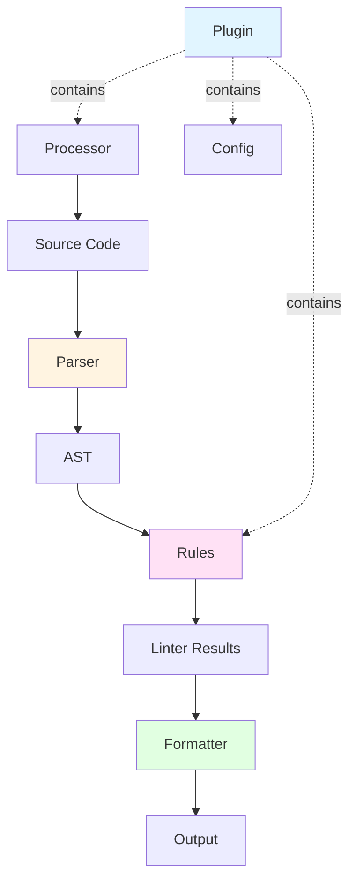

# Extending ESLint

ESLint is designed to be completely extensible, allowing you to create custom rules, parsers, processors, formatters, and plugins to meet your project's unique needs.

## Prerequisites

To extend ESLint, you should have:

- Knowledge of JavaScript, since ESLint is written in JavaScript
- Familiarity with Node.js, since ESLint runs on it
- Comfort with command-line programs
- Understanding of Abstract Syntax Trees (ASTs)

<Tip>
Use [ESLint Code Explorer](http://explorer.eslint.org) to visualize AST structures and scope information for any JavaScript code.
</Tip>

## Ways to Extend ESLint

ESLint provides multiple extension points, each serving different purposes:

<CardGroup cols={2}>
  <Card title="Custom Rules" icon="gavel" href="./custom-rules">
    Create rules to enforce code standards specific to your project or organization.
  </Card>
  
  <Card title="Custom Parsers" icon="code" href="./custom-parsers">
    Enable ESLint to understand non-standard JavaScript syntax or new language features.
  </Card>
  
  <Card title="Custom Processors" icon="file-code" href="./custom-processors">
    Process non-JavaScript files to extract and lint JavaScript code.
  </Card>
  
  <Card title="Custom Formatters" icon="table" href="./custom-formatters">
    Control how ESLint displays linting results.
  </Card>
  
  <Card title="Plugins" icon="plug" href="./plugins">
    Bundle rules, processors, and configs into reusable packages.
  </Card>
  
  <Card title="Shareable Configs" icon="share-nodes" href="./shareable-configs">
    Share ESLint configurations across multiple projects.
  </Card>
</CardGroup>

## Extension Architecture

Understanding how these extensions work together:



### Parser
Transforms source code into an Abstract Syntax Tree (AST) that ESLint can analyze. Custom parsers enable support for TypeScript, JSX, or experimental syntax.

### Rules
Analyze the AST and report problems. Rules are the core of ESLint's functionality.

### Processor
Extracts JavaScript from non-JavaScript files (like Markdown or HTML) before parsing.

### Formatter
Formats linting results for display or integration with other tools.

### Plugin
Packages multiple extensions together for distribution.

## Common Use Cases

<AccordionGroup>
  <Accordion title="Enforcing Team-Specific Patterns">
    Create custom rules to enforce patterns unique to your codebase:
    
    - Specific naming conventions
    - Custom API usage patterns
    - Architecture constraints
    - Security requirements
  </Accordion>
  
  <Accordion title="Supporting Custom Syntax">
    Build custom parsers for:
    
    - Domain-specific languages
    - Experimental JavaScript features
    - TypeScript or Flow type annotations
    - Template languages
  </Accordion>
  
  <Accordion title="Linting Non-JavaScript Files">
    Use processors to lint:
    
    - Markdown code blocks
    - HTML script tags
    - Vue single-file components
    - Svelte components
  </Accordion>
  
  <Accordion title="Integrating with Tools">
    Create formatters for:
    
    - CI/CD pipelines
    - IDE integrations
    - Code review systems
    - Custom reporting dashboards
  </Accordion>
</AccordionGroup>

## Development Workflow

<Steps>
  <Step title="Understand the AST">
    Use the [ESLint Code Explorer](http://explorer.eslint.org) to visualize how your code is represented as an AST.
    
    ```javascript
    // Example code
    const x = 5;
    
    // Produces AST nodes:
    // - Program
    //   - VariableDeclaration (kind: "const")
    //     - VariableDeclarator
    //       - Identifier (name: "x")
    //       - Literal (value: 5)
    ```
  </Step>
  
  <Step title="Implement Your Extension">
    Create your rule, parser, processor, or formatter following the appropriate guide.
  </Step>
  
  <Step title="Test Thoroughly">
    Use `RuleTester` for rules and write comprehensive test cases.
    
    ```javascript
    const { RuleTester } = require("eslint");
    const ruleTester = new RuleTester();
    
    ruleTester.run("my-rule", rule, {
      valid: ["const x = 1;"],
      invalid: [{
        code: "var x = 1;",
        errors: [{ message: "Use const instead" }]
      }]
    });
    ```
  </Step>
  
  <Step title="Package and Publish">
    Bundle as a plugin or shareable config and publish to npm.
  </Step>
</Steps>

## Performance Considerations

<Warning>
Extensions run for every file linted. Follow these best practices:

- **Minimize AST traversal**: Only visit necessary node types
- **Cache expensive computations**: Store results when possible
- **Avoid synchronous I/O**: Never read files synchronously in rules
- **Use efficient algorithms**: O(n²) operations can severely impact performance
</Warning>

### Profiling Rules

Measure rule performance using the `TIMING` environment variable:

```bash
TIMING=1 eslint lib
```

Output shows the slowest rules:

```
Rule                    | Time (ms) | Relative
:-----------------------|----------:|--------:
no-unused-vars          |    52.472 |     6.1%
no-shadow               |    48.684 |     5.7%
```

## Core APIs

Key APIs you'll use when extending ESLint:

<CardGroup cols={3}>
  <Card title="SourceCode" icon="file-code">
    Access tokens, comments, and AST navigation methods
  </Card>
  
  <Card title="RuleTester" icon="vial">
    Test framework for validating rule behavior
  </Card>
  
  <Card title="context" icon="circle-info">
    Provides rule metadata, reporting, and configuration
  </Card>
  
  <Card title="Scope" icon="layer-group">
    Track variable declarations and references
  </Card>
  
  <Card title="fixer" icon="wrench">
    Apply automatic fixes to code
  </Card>
  
  <Card title="CodePath" icon="route">
    Analyze code execution paths
  </Card>
</CardGroup>

## Best Practices

### Documentation

- Provide clear descriptions of what your extension does
- Include examples of valid and invalid code patterns
- Document all configuration options
- Link to relevant resources

### Testing

- Test edge cases and error conditions
- Include tests for all options and configurations
- Verify fixes don't introduce new problems
- Test performance with large files

### Versioning

- Follow semantic versioning (semver)
- Document breaking changes clearly
- Maintain changelog
- Test against multiple ESLint versions

### Distribution

- Use clear naming conventions (e.g., `eslint-plugin-*`)
- Add appropriate npm keywords
- Include comprehensive README
- Specify peer dependencies correctly

## Next Steps

<CardGroup cols={2}>
  <Card title="Create Custom Rules" icon="play" href="./custom-rules">
    Start with the most common extension type
  </Card>
  
  <Card title="Build a Plugin" icon="play" href="./plugins">
    Package your extensions for distribution
  </Card>
</CardGroup>

## Additional Resources

- [ESLint Architecture Documentation](../integrate/nodejs-api)
- [ESTree Specification](https://github.com/estree/estree)
- [ESLint Code Explorer](http://explorer.eslint.org)
- [Scope Manager Interface](./scope-manager-interface)
- [Code Path Analysis](./code-path-analysis)